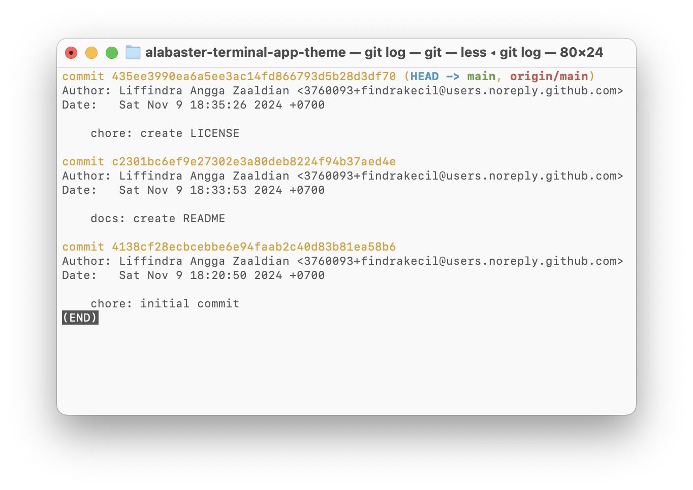
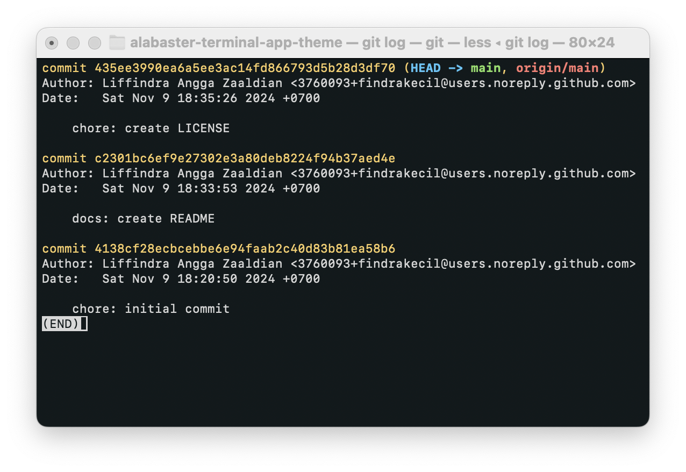

# About

Light and dark theme for macOS Terminal app using Alabaster color palettes.

# Screenshots

## Alabaster Light

## Alabaster Dark

# Credits

- [@tonsky](https://github.com/tonsky) the creator of Alabaster theme.
- [Alabaster Dark Theme for Visual Studio Code](https://github.com/gargakshit/vscode-theme-alabaster-dark) by [@gargakshit](https://github.com/gargakshit/vscode-theme-alabaster-dark).
- [Alabaster Dark for Alacritty](https://github.com/alacritty/alacritty-theme/blob/master/themes/alabaster_dark.toml)